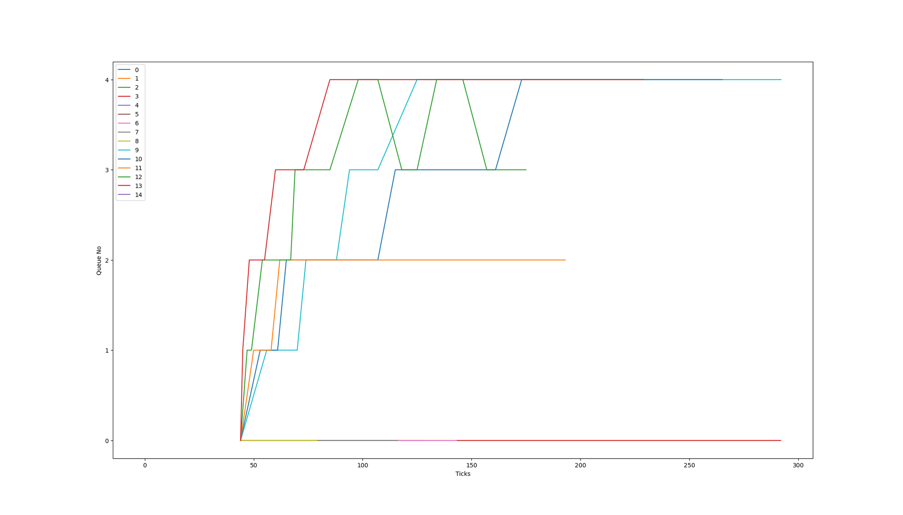

# Enhancing XV-6
Tweaking the xv6 simplified operating system developed at MIT implemented for a modern RISC-V multiprocessor using ANSI C. This project has added custom system calls, implemented scheduling policies that are incorporated into xv6. And modified the defalut `fork` implementation to Copy-on-write fork implementation in xv6.

## Specification 1: System Calls

### System Call 1: `trace`

#### Added (in struct proc in kernel/proc.h)
- `Is_Traced` to tell if the process is being tracked
- `Trace_Mask` to hold the mask based on which selective syscalls will be tracked

#### Implemented strace (in user/strace.c)
- Takes `strace <mask_no> <command>` from the terminal
- Calls `trace` syscall
- Executes the command that was supplied as the argument.

#### Implemented trace system call (in kernel/proc.c) [as sys_trace]
- Accesses the `proc structure` of the process and turns `Is_Traced` on.
- Also sets `Trace_Mask` to the mask supplied
  
#### Modified (in syscall in kernel/syscall.c)
- Structure to save arguments supplied to the system call.
- Condition to check the `Is_Traced` flag and print details if true.

#### Logic
- When `strace` is called on a process, it calls the `trace` syscall to make the process traceable by turning the `Is_Traced` flag on.
- [All its children are also going to be traceable because `Is_Traced` and `Trace_Mask` are copied in the `fork()` function]
- And in the syscall function (kernel/syscall.c), arguments to the syscall are temporarily stored before the syscall is called. 
- After the syscall is called, the return value + arguments are printed in the given format only if the `Is_Traced` value for that process is 1.

   

### System Call 2: `sigalarm` & `sigreturn`

#### Added (in struct proc in kernel/proc.h)
- `Handler` to hold the handler function to be called every ticks number of ticks.
- `Ticks` to hold the number of ticks after which handler is called.
- `Current_ticks` to hold the number of ticks that the process has consumed till now.
- `Sigalarm_tf` to duplicate the process’ trapframe, and restore after sigreturn.

#### Implemented sigalarm (in kernel/sysproc.c) as sys_sigalarm
- Sets the ticks and handler input by user
- Also set current_ticks to 0
#### Implemented sigreturn (in kernel/sysproc.c) as sys_sigreturn
- Restores the trapframe of the process
- Also resets current_ticks to 0

#### Logic
- If sigalarm has been called (if `ticks` > 0), on every timer interrupt, increment `current_ticks`.
- If we have reached the desired number of `ticks`, save the trapframe and call the handler by setting `epc` to it.
- Since we know that the handler always calls sigreturn before returning, set `current_ticks` to 0 and restore trapframe in sigreturn to start the cycle again.

------------------------
## Specification 2: Scheduling

Added `SCHED_FLAG` in the makefile which tells the kernel which scheduling policy to use. Usage:

> `make clean qemu SCHED_FLAG=<name_of_policy>`

name_of_policy can be:
- `FCFS` = First Come First Served
- `LBS` = Lottery Based Scheduling
- `PBS` = Priority Based Scheduling
- `MLFQ` = Multi Level Feedback Queue
-----------------
### a. FCFS
#### Added (in struct proc in kernel/proc.h)
- Creation_time to hold the number of ticks at which the process was created.

#### Added (in kernel/proc.c)
- Set creation_time to number of ticks in allocproc(), when the process is created.

#### Implemented FCFS (in kernel/proc.c)
- Loop through all processes (proc[NPROC]) to find the process with the least creation time, locking appropriately.
- Run this process, if it exists.

#### Notes
Disabled preemption by not giving up the CPU (`yield()`) on timer interrupts (`devintr() = 2`) in both usertrap() and kerneltrap() in kernel/trap.c.

### b. LBS
#### Added (in struct proc in kernel/proc.h)
- `Tickets` to hold the number of tickets the process possesses.

#### Added (in kernel/proc.c)
- Set `tickets` to 1 (default) in allocproc(), when the process is created.

#### Implemented LBS (in kernel/proc.c)
- Find total number of allocated tickets to all runnable processes.
- Find a winner number, using a random number generator, mod with total_tickets.
- Find the winning process, that satisfies the cumulative ticket count constraint.
- If that process is runnable, run it.

#### Implemented `int settickets(int number)` (in kernel/proc.c)
- This syscall increases the number of tickets of the process calling it by the argument that is passed.

#### Logic / Others
Give child processes the same number of tickets as their parents, in fork() (kernel/proc.c)
#### Notes
Sys_settickets is just a wrapper function that calls settickets(), or does error handling if LBS scheduling is not in use

--------------------
### c. PBS
#### Added (in struct proc in kernel/proc.h)
- `run_time` to hold the number of ticks the process has run for, independent of other times it was run (if any).
- `sleep_time` to hold the number of ticks the process was in sleeping state, since the last time it was scheduled.
- `times_scheduled` to hold the number of times the process was scheduled.
- `static_priority` to hold the static priority of the process.

#### Added (in kernel/proc.c)
- Set `run_time`, `sleep_time`, and `times_scheduled` to 0 in allocproc(), because the process has just been created.
- Set `static_priority` to 60 (default).
- A helper function `update_proc_info()` that increments `run_time` for running processes and `sleep_time` for sleeping processes, for all processes in `proc[NPROC]`. This function is called at every tick increment.

#### Implemented PBS (in kernel/proc.c)
- Find the `dynamic_priority` of each process using the given formula.
- Find the process with the most priority (least numerical value of `dynamic_priority`), using the given tie breaking constraints.
- After we go through all of `proc[NPROC]`, we’ll be left with the process we need, if it exists.
- Run this process, also increment `times_scheduled`. Reset its `run_time` and `sleep_time` to 0.

#### Implemented `int set_priority(int new_priority, int pid)` (in kernel/proc.c)
- This syscall sets the priority of the process with the given `pid` to the `new_priority` passed.
- Also resets the `run_time` and `sleep_time` of the process to 0.
- Returns `old_priority`, i.e. previous `static_priority` of the process, if it was found, else returns -1

#### Logic / Others
- Added `sys_set_priority()` that acts as a wrapper for `set_priority(int new_priority, int pid)`, but also `yield()`s if the process gets higher priority.
- Implemented a user program `setpriority.c`, which uses the above system call to change the priority of a process.

#### Notes
Disabled preemption by not giving up the CPU (`yield()`) on timer interrupts (`devintr() = 2`) in both usertrap and kerneltrap in kernel/trap.c

### d. MLFQ

#### Added (in struct proc in kernel/proc.h)
- `queue_no` to hold the current queue number.
- `mticks` to hold the number of ticks used in the queue’s respective time slice. 
- `mstart` to hold the start time of the process.

#### Added (in kernel/proc.c)
- Structures to have five queues (array implementation of queue)
- 5 arrays `q0,q1,q2,q3,q4` and their sizes `e0,e1,e2,e3,e4`
- Routines to push front and back to the queue, pop form an index, pop and push back to the queue.
- Routine to find a process `p` and remove it from the queue.
- Structure to hold time slices and aging thresholds for different queues.

#### Added (in `allocproc()` in kernel/proc.c) 
- Set `queue_no` and `mticks` to 0, `mstart` to `ticks`.
- Push the process to `q0`. 

#### Added `CheckRunnable()` (in kernel/proc.c)
- Iterates through all process addresses in the `proc[NPROC]` structure.
- If it finds a process that is NOT in the queue and is runnable, it adds it to `q0`.
#### Added `CheckAging()` (in kernel/proc.c)
- Iterates through all process addresses in the proc[NPROC] structure.
- If it finds a process that *is* in the queue and is runnable, it checks its runtime.
- Its runtime will be equal to `ticks - mstart`. If that is greater than the aging threshold for the queue it is present in, then pop it and push it into queue of higher priority
- Reset `mstart` to `ticks`.

#### Implemented MLFQ (in kernel/proc.c)
- Call `CheckRunnable()` and `CheckAging()`
- Iterate through all queues starting from the highest priority to the lowest priority queue and check if a runnable process exists. If found, run it.
- Increment `mticks` on every tick.
- Check if any process finished its time slice (by comparing its `mticks` to time slice) and push it to the next queue if so. [Clear `mticks` to 0 if the queue is changed]
- `yield()` after each tick to start the iteration process all over again.
- For the last queue, if the process completes its time-slice, pop it, and push it back to the end of the same queue.
- Pop a process if it completes its execution.

#### Logic
- Preemption of the current process when a new process enters a higher queue is ensured by the fact that we are yielding after every tick and resuming a runnable process with highest priority after every tick.
- And by the fact that runnable processes that are not already in the queue are searched for by `CheckRunnable()` after every tick.

----------------------

## Specification 4: Copy-On-Write Fork()

#### Added (in kernel/riscv.h)
- Flag `PTE_COW` to mark a given page as a `COW page`.

#### Added (in kernel/kalloc.c)
- A structure that keeps a count of references to a given page.
- Routines to increase and decrease the reference counts.
  
#### Modified `uvmcopy()` (in kernel/vm.c)
- Removed the part where a new page was being allocated and mapped to.
- Instead mapping to the old page and marking it as a` COW page`. [Also Removing its Write permissions]
- Incrementing reference count to this page.

#### Modified `usertrap()` (in kernel/trap.c)
- Added another check to catch traps caused by writing to a page that does not have write permissions. (i.e., `COW pages`) and handle the trap using `cow_handler()`.

#### Implemented `cow_handler()` (in kernel/trap.c)
- Decrements references to the given page.
- Unmaps the page, allocates memory for a fresh page and maps that instead.
- Gives write permissions to the new page and removes the `COW flag`.

#### Modified kfree (in kernel/kalloc.c)
- Does not free immediately.
- Decrements the reference count and frees only if the count is 0.

#### Logic
- `Uvmcopy` now does not allocate fresh memory whenever `fork` is called. It simply increments the reference count of that page and removes its write permissions.
- If any process tries to write to such a page, a user trap with `s_cause() ` value 15 is generated .
- Such a process needs a new page that is writable which is exactly what `cow_handler()` does. It decrements the reference count and unmaps the page, allocates memory for a fresh page and maps that instead.
- `Kfree` is modified because we do not want the page to be freed when there are processes still referencing it. It frees when the reference count is zero i.e., when no more processes are pointing to it.

-----------

## Scheduling Analysis

- `wtime`, `rtime`, and `total_time` for schedulertest with some modifications to avoid compiler optimisation in each scheduling are mentioned below

| Algorithm | wtime | rtime | total_time |
| --- | --- | --- | --- |
| FCFS | 108 | 25 | 134 |
| LBS | 111 | 24 | 135 |
| PBS | 186 | 29 | 215 |
| MLFQ | 103 | 26 | 128 |

> `total time = waiting_time + running_time`

- order on basis of finishing time
    
     `PBS >> LBS > FCFS > RR > MLFQ`     
    
	a huge difference in PBS and other is due to non-preemitive implementation in PBS

- PBS has largest finishing time as there is no preemption and if a process with larger time comes first all the rest processes have to starve for cpu execution. This is called the Convoy effect.
- LBS , MLFQ and  FCFS have nearly same finishing time. This could be because lottery wise picking is as bad as picking the first one in probabilistic sense (especially when all tickets are just 1) . And because MLFQ has the same overhead as FCFS for the first few queues.
- MLFQ has reasonable time as there are many queues with different priorities and a process which takes more CPU time is shifted to less priority queue and also prevents starvation by aging i.e shifting to upper queues after some fixed time. Hence it is optimal.

## MLFQ analysis

Running MLFQ on the given  `schedulertest` with some modifications to avoid compiler optimisation

# Enhancing-xv6
